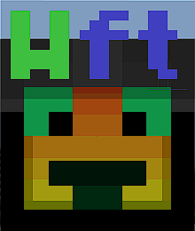

# WFT - 1.3.6
### Hello, and welcome to **WFT**. 



### NOW IN API 4.0

This is the official recode of my old plugin WFT, witch had some issues. Overall I was not happy with the result, the code was messy, it was all in one file, there was useless and in-efficient code, with a hard api to use, so decided to recode it.

I have added features, because I felt the plugin needed them, and removed features, as some features where not needed.

## Features added

- WFT-OLD Migration
- Multiple language support
- Optional display identifier
- More Tags
- Per-Player Texts
- Packet Texts over Entity
- More efficient and pretty code

Migration: This should have been added on 1.0, but texts from WFT-OLD will now be automaticly migrated to WFT format.

Language support: You can now change the language of the plugin to suit your server.

Display identifier: You can now turn on or off the option to see the texts unique identifier (Much like Texter, but optional).

More tags: Added many more tags for better, they are also player specific.

Per-Player texts: Players will now get a specific text depending on what tag you use.

Packets: The old plugin used entities, putting more load on the server, whereas this plugin uses packets, therefore creating a more lightweight plugin.

Efficient and pretty code: The code in this plugin is WAY more efficient and clean that the old plugin. The code is also spaced out in multiple files.

## Bug Fixes

### https://github.com/WolfDen133/WFT/issues/21
**Status**: Fixed

**Version**: >=1.3.5

**Fixed in**: <=1.3.6

### https://github.com/WolfDen133/WFT/issues/20
  **Status**: Fixed
  
  **Version**: >=1.3.4

  **Fixed in**: <=1.3.5

### https://github.com/WolfDen133/WFT/issues/12
  **Status**: Fixed
  
  **Version**: >=1.3.1
  
  **Fixed in**: <=1.3.2

### https://github.com/WolfDen133/WFT/issues/16 
  **Status**: Fixed
  
  **Version**: >=1.3.2
  
  **Fixed In**: <=1.3.3

## Features

- Refresh timer
- Tags for various things
- Lots of useful commands
- Form or command line options
- Help subcommand for new people 
- Powerful fast and efficient code
- Extensive customizable

## Example


## Commands

Master command is ft|wft.master

| Subcommand | Permission        | Description                      | Aliases                                                |
|------------|-------------------|----------------------------------|--------------------------------------------------------|
| `wft`      | `wft.command.use` | The master command               | `ft`                                                   |
| `add`      | ~                 | Add a new ft                     | `spawn`, `summon`, `new`, `make`, `create`, `c`, `a`   |
| `remove`   | ~                 | Remove a existing ft             | `break`, `delete`, `bye`, `d`, `r`,                    |
| `edit`     | ~                 | Edit an existing ft              | `e`, `change`                                          |
| `tp`       | ~                 | Teleport to an ft                | `teleportto`, `tpto`, `goto`, `teleport`               |
| `tphere`   | ~                 | Teleport a ft to you             | `teleporthere`, `movehere`, `bringhere`, `tph`, `move` |
| `list`     | ~                 | See a list of the current fts    | `see`, `all`                                           |
| `help`     | ~                 | So you can get some in-game help | `stuck`, `h`, `?`                                      |

## Tags

| Tag                | Description                                                |
|--------------------|------------------------------------------------------------|
| `#`                | New line                                                   |
| `&`                | Use for color codes (same as `§`)                          |
| `{NAME}`           | Players real name                                          |
| `{REAL_NAME}`      | Players real name                                          |
| `{DISPLAY_NAME}`   | Players display name (often nick plugins use display name) |
| `{PING}`           | Players Current Ping                                       |
| `{MAX_PLAYERS}`    | Maximum players that can be on the server                  |
| `{ONLINE_PLAYERS}` | Currently online player count                              |
| `{X}`              | Players X Position                                         |
| `{Y}`              | Players Y Position                                         |
| `{Z}`              | Players Z Position                                         |
| `{REAL_TPS}`       | Current server tps                                         |
| `{TPS}`            | Average server tps                                         |
| `{REAL_LOAD}`      | Current server load                                        |
| `{LOAD}`           | Average server load                                        |
| `{LEVEL_NAME}`     | Players current level name                                 |
| `{LEVEL_FOLDER}`   | Players current level folder name                          |
| `{LEVEL_PLAYERS}`  | Players current level player count                         |
| `{CONNECTION_IP}`  | The IP address that the player connected from              |
| `{SERVER_IP}`      | The servers IP address                                     |
| `{TIME}`           | Current server time (Customisable in config)               |
| `{DATE}`           | Current server date (Customisable in config)               |

### Create your own
  See how to create your own [here](https://github.com/WolfDen133/WFT-Tags-Example)
 
## Languages
- Czech (cz)
- English (en)
- German (de)
- Russian (ru)
- Slovak (sk)
- Spanish (sp)
- Ukrainian (ua)
- Turkish (tr)
- Indonesian (id)

But feel free to add your own!
  
## API

Example:

Import the classes
```php

use WolfDen133\WFT\WFT;
use WolfDen133\WFT\Texts\FloatingText;

```
Creating the text
```php
// Creation and registration
$floatingText = new FloatingText(new Position($x, $y, $z, $level), $name, $text);
WFT::getAPI()->registerText($floatingText);

// Spawning
WFT::getAPI()::spawnTo($player, $floatingText);
// or
WFT::getAPI()::spawnToAll($floatingText);
```

Changing the ft's text
```php
// Changing the text
$floatingText->setText($text);

// Pushing the update
WFT::getAPI()::respawnTo($player, $floatingText);
// or 
WFT::getAPI()::respawnToAll($floatingText);
```

That's it, the rest is handled by the plugin

## Credit

- [**WolfDen133**](https://github.com/WolfDen133) (*Main Programmer*) [ฬ๏ɭŦ๔єภ133;#6969]
- [**McMelonTV**](https://github.com/McMelonTV) (*Translations - Slovak, Czech*) [McMelon#9999]
- [**TheFixDev**](https://github.com/TheFixDev) (*Translation - German*) [𝓗𝓪𝓫𝓓𝓲𝓬𝓱𝓢𝓸𝓖𝓮𝓻𝓷#6158]
- [**kostamax27**](https://github.com/kostamax27) (*Suggestion & Translation - Russian, Ukrainian*) [kostamax27#0160]
- [**Sergittos**](https://github.com/Sergittos) (*Translation - Spanish*) [Sergittos#0001]
- [**DragonfireHD**](https://github.com/DragonfireHD) (*Translation - Turkish*)
- [**keenanyafiqy**](https://github.com/keenanyafiqy) (*Translation - Indonesian*)

